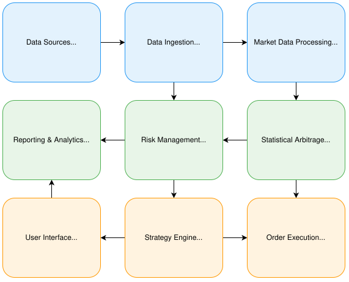

<div align="center">
  <h1>AlgoStream</h1>
  <h2>Statistical arbitrage research platform in OCaml 5</h2>
  <p>
    <a href="https://github.com/chizy7/AlgoStream/blob/main/LICENSE"></a>
    <a href="https://github.com/chizy7/AlgoStream"></a>
    <a href="https://github.com/chizy7/AlgoStream/actions/workflows/ci.yml"></a>
  </p>
  <p>
    <a href="https://chizy7.github.io/AlgoStream/guides/">Documentation</a>&nbsp;&nbsp;•&nbsp;&nbsp;
    <a href="docs/guides/getting_started.md">Getting Started</a>&nbsp;&nbsp;•&nbsp;&nbsp;
    <a href="https://chizy7.github.io/AlgoStream/api/">API Reference</a>&nbsp;&nbsp;•&nbsp;&nbsp;
    <a href="docs/guides/deployment.md">Deployment</a>
  </p>
</div>

---

## Overview

AlgoStream is an event-driven platform for researching statistical-arbitrage strategies: live
market-data ingestion, cointegration and mean-reversion analytics, a backtest engine, and a live
runtime that drives the same strategy code against a real feed.

**It is paper trading.** There is no venue connectivity anywhere in the project — no exchange
credentials, no request signing, no trading endpoint, so nothing here can place a real order. Fills
are simulated against live quotes by the same engine the backtester uses, and
`test/runtime/test_parity.exe` asserts the live runtime and the backtest produce identical results
from one fixture. That equivalence is the claim the project makes; anything about real execution
would need a venue this project does not have.

### Measured

| | | Reproduce with |
|---|---|---|
| Event-bus latency | **0.07 ms** p50 · **0.15 ms** p99 | `make paced-bench RATE=50000` |
| Ingestion throughput | **427k ev/s** | `make ingest-bench` |
| Bus throughput | **~850k ev/s** | `make bench` |
| Test suite | **709 cases** across 25 suites | `dune runtest` |

Apple Silicon, release profile. Latency is publish-to-handler through the priority queue at a
stated offered load; there is no venue leg to include, so this is not an order-execution figure.

The other latency benchmark, `event_bus_latency`, saturates the bus on purpose and reports queueing
delay in the tens of milliseconds by construction. Both are real and they answer different
questions — `paced-bench` is the one comparable to a latency target.

## Architecture



An event bus sits at the centre: ingestion publishes into a four-band priority queue, a dispatcher
Domain fans out to subscribers, and each processor drains into its own Domain and publishes an
immutable snapshot other Domains read atomically. Strategies are pure functions over events, so the
same `Strategy.S` runs under the backtester and the live runtime.

| Library | What it does | Guide |
|---|---|---|
| `infrastructure/event_bus` | Priority queue, filters, append-only log and replay | [event bus](docs/guides/event_bus.md) |
| `infrastructure/{lwt_host,network}` | Single Lwt scheduler; HTTP API and SSE dashboard | [dashboard](docs/guides/dashboard.md) |
| `infrastructure/{auth,persistence}` | Bearer keys with scopes; hash-chained audit log | [security](docs/guides/security.md) |
| `domain` | Orders, trades, portfolio, positions, pairs | [domain models](docs/guides/domain_models.md) |
| `data_ingestion` | Binance and Coinbase WebSocket connectors | [ingestion](docs/guides/data_ingestion.md) |
| `normalization`, `time_series` | Canonical symbols, bar building, alignment | [normalization](docs/guides/normalization.md) · [time series](docs/guides/time_series.md) |
| `analytics`, `pairs` | Rolling statistics; cointegration, hedge ratio, z-score | [analytics](docs/guides/analytics.md) · [pairs](docs/guides/pairs.md) |
| `advanced_models` | Ornstein-Uhlenbeck, Kalman, GARCH, regime detection | [advanced models](docs/guides/advanced_models.md) |
| `strategy`, `backtest` | The strategy contract and the fill simulator | [backtesting](docs/guides/backtesting.md) |
| `order_management`, `risk_management` | Routing, sizing, execution quality; VaR and limits | [order management](docs/guides/order_management.md) · [risk](docs/guides/risk_management.md) |
| `montecarlo`, `optimization`, `performance` | Simulation, walk-forward, attribution | [monte carlo](docs/guides/monte_carlo.md) · [optimization](docs/guides/optimization.md) |
| `runtime`, `telemetry`, `reporting` | Live paper runner, metrics, report export | [live runtime](docs/guides/live_runtime.md) · [telemetry](docs/guides/telemetry.md) |

Written in OCaml 5.x — `Domain` for parallelism, `Atomic` for publication, Lwt for I/O. The
numerics are hand-rolled rather than pulled from a linear-algebra dependency; the reasoning is in
the relevant guides.

## Quick Start

### Prerequisites

- **OCaml 5.0 or newer.** The project uses `Domain`, so 4.x will not build it. CI covers 5.0.x and
  5.1.x on Linux and macOS. If your active switch is a 4.x one, `make` targets fail with
  `Library ... not found` rather than anything naming the real cause.
- OPAM package manager
- Docker (optional, for `perf`/`valgrind`/`gprof` profiling on macOS)

### Installation

```bash
git clone https://github.com/chizy7/AlgoStream.git
cd AlgoStream

# Easiest path: creates a local 5.1.1 switch and installs everything
./scripts/setup-dev.sh
eval $(opam env)

# Or do it manually
opam switch create . ocaml-base-compiler.5.1.1
eval $(opam env)
opam install . --deps-only --with-test --with-dev-setup

make build           # dune build
make test            # dune runtest
make fmt             # dune build @fmt --auto-promote
make fmt-check       # CI-style check (no auto-fix); fails if anything would change
```

### Profiling in Docker (recommended on macOS)

```bash
make docker-dev      # build Dockerfile.dev + start container
make docker-shell    # bash into the container
# inside the container:
make perf-record     # produces perf.data
make valgrind-massif # produces massif.out.* (heap profile)
make memtrace BIN=bin/event_replay.exe ARGS="--log-file replay.bin"
```

## Running the System

### The dashboard, unauthenticated

The quickest look at a running system:

```bash
make dash
```

Then **http://127.0.0.1:8080/dashboard/** — note the path; `/` is the landing page.

No keystore means no credential required, and the listener is loopback-only.

### With authentication

```bash
# The key is printed ONCE. Only its SHA-256 goes into the keystore.
dune exec bin/keyctl.exe -- add --label laptop --scopes read,control

# A read-only one as well, to watch the control buttons grey out
dune exec bin/keyctl.exe -- add --label viewer --scopes read

dune exec bin/keyctl.exe -- list
```

Keys land in `$XDG_CONFIG_HOME/algostream/keys.json` (`~/.config/...`), mode `0600` — the daemon
**refuses to start** if the permissions are wider, rather than warning.

```bash
dune exec bin/algostream.exe -- \
  --auth-keys ~/.config/algostream/keys.json \
  --audit-dir /tmp/algostream-audit \
  --static site/ --http-port 8080
```

The dashboard now prompts for a key. Paste the **read-only** one first: the stream goes live and all
three control buttons disable with "this key is read-only". Sign out, paste the control key, and
they enable.

Directly:

```bash
KEY='ask_...'
curl -s  localhost:8080/api/health | jq         # public — shows auth_required
curl -i  localhost:8080/api/telemetry           # 401 + WWW-Authenticate
curl -i -XPOST -H "Authorization: Bearer $KEY" localhost:8080/api/strategies/pairs-1/stop
```

`/api/health` stays public deliberately, so a client can tell a live daemon from an unreachable one
without holding a credential.

### The audit trail

```bash
dune exec bin/auditctl.exe -- tail   /tmp/algostream-audit
dune exec bin/auditctl.exe -- verify /tmp/algostream-audit   # exit 1 on a break, cron-friendly
dune exec bin/auditctl.exe -- head   /tmp/algostream-audit
```

`head` prints the **anchor** — copy it somewhere the daemon cannot write. The chain is unkeyed, so
anyone who can write the log can recompute it and hand you a file that verifies perfectly. The
[security guide](docs/guides/security.md) shows how to demonstrate that, and what an anchor buys you.

### Metrics and the observability stack

```bash
curl -s -H "Authorization: Bearer $KEY" localhost:8080/metrics | head

make stack-up      # daemon + Prometheus + Grafana + Alertmanager; mints keys on first run
make stack-down
```

Scope-gated like every other observation endpoint. Grafana `:3000` (anonymous viewer), Prometheus
`:9090`, Alertmanager `:9093` — all bound to loopback.

## Documentation

- **[Getting Started Guide](docs/guides/getting_started.md)** — setup, first run, troubleshooting
- **[Event Bus Guide](docs/guides/event_bus.md)** — Publish/subscribe, filters, replay, instrumentation, memtrace
- **[Domain Models Guide](docs/guides/domain_models.md)** — Complete guide to core models
- **[Backtesting Guide](docs/guides/backtesting.md)** — strategy contract, fill model, step ordering
- **[Monte Carlo Guide](docs/guides/monte_carlo.md)** — RNG determinism, bootstrap, stress, parallel speedup
- **[Performance Analytics](docs/guides/performance_analytics.md)** — metric conventions and consolidation
- **[Strategy Optimization](docs/guides/optimization.md)** — walk-forward, purged CV, overfitting statistics
- **[Security](docs/guides/security.md)** — threat model, keys, scopes, the audit chain
- **[Deployment](docs/guides/deployment.md)** — container, observability stack, Kubernetes
- **[Operations runbook](docs/guides/operations.md)** — what to do when something is wrong
- **[Performance tuning](docs/guides/performance_tuning.md)** — GC, pinning, machine-level settings
- **[Statistical arbitrage theory](docs/mathematical_models/statistical_arbitrage.md)** — mathematical foundations

All 24 guides are published at **[chizy7.github.io/AlgoStream/guides](https://chizy7.github.io/AlgoStream/guides/)**,
and the generated API reference at **[/api](https://chizy7.github.io/AlgoStream/api/)**.

## Testing

```bash
make test            # alcotest, the full suite
# or:  dune runtest

# A few of the suites
dune exec test/domain/test_runner.exe                       # 11 domain tests
dune exec test/infrastructure/event_bus/test_runner.exe     # 14 event-bus tests
dune exec test/backtest/test_runner.exe                     # 27 backtest tests
dune exec test/montecarlo/test_runner.exe                   # 26 Monte Carlo tests
dune exec test/optimization/test_runner.exe                 # 44 optimization tests

# Lints: clock leaks in pure layers, banned RNGs, metric duplication
make determinism-lint

# Security lints: constant-time comparison, no deterministic RNG in auth,
# append-only audit log, no credentials committed
python3 scripts/security-lint.py

# Kubernetes and alert-rule schemas (Docker)
make k8s-validate

# Performance benchmarks (release profile)
make bench           # text output
make bench-json      # JSON output for github-action-benchmark
make paced-bench     # latency at a stated offered load — the figure to quote
```

## Deployment

Full detail in [docs/guides/deployment.md](docs/guides/deployment.md), which records what has
actually been exercised and what has not.

### Docker

```bash
make docker-release            # multi-stage build: non-root, no sudo, read-only rootfs
make stack-up                  # daemon + Prometheus + Grafana + Alertmanager
make stack-down
```

`Dockerfile` (root) is the release image. `Dockerfile.dev` is a **profiling shell** — passwordless
sudo, `SYS_ADMIN`, `seccomp:unconfined` — which is correct for running `perf` and valgrind and
disqualifying for anything unattended. Never derive one from the other.

A container must bind `0.0.0.0`, since a pod's loopback is unreachable from outside its network
namespace. That is exactly the case the daemon refuses by default, so `--auth-keys` is **mandatory**
in a container and it exits 2 without one.

### Kubernetes

```bash
make k8s-validate                                    # kubeconform -strict + promtool
kubectl create secret generic algostream-keys --from-file=keys.json
kubectl apply -f k8s/
scripts/blue-green.sh --image algostream:v2          # health-gates before flipping the Service
scripts/blue-green.sh --rollback
```

> **What has been exercised:** the manifests and the blue/green script have been applied to a
> single-node kind cluster, where the pod reached Ready through its own `/api/health` probes and a
> promotion and a rollback both completed without the Service losing its endpoint. **Multi-node is
> unproven**, and the resource figures are reasoned from the benchmarks rather than measured under
> load. The `Secret` in `k8s/service.yaml` is a template carrying no key material.
>
> One real constraint: the audit volume is `ReadWriteOnce` and both slots mount it, so a cross-node
> blue/green handover blocks until the old pod releases it. Pin both slots to one node, use a
> `ReadWriteMany` class, or accept a brief gap.

`replicas` is 1 per slot on purpose. Each instance opens its own exchange connections and runs its
own copy of the strategy, so a second replica means duplicate subscriptions and two independent
paper portfolios rather than shared load. Blue/green buys availability across a *deploy*; it does
not make this a clustered system.

## Contributing

Contributions are welcome — see [CONTRIBUTING.md](CONTRIBUTING.md) for the build setup, code style
and test expectations. Security issues should go through [SECURITY.md](SECURITY.md) rather than a
public issue.

## License

MIT — see [LICENSE](LICENSE).
