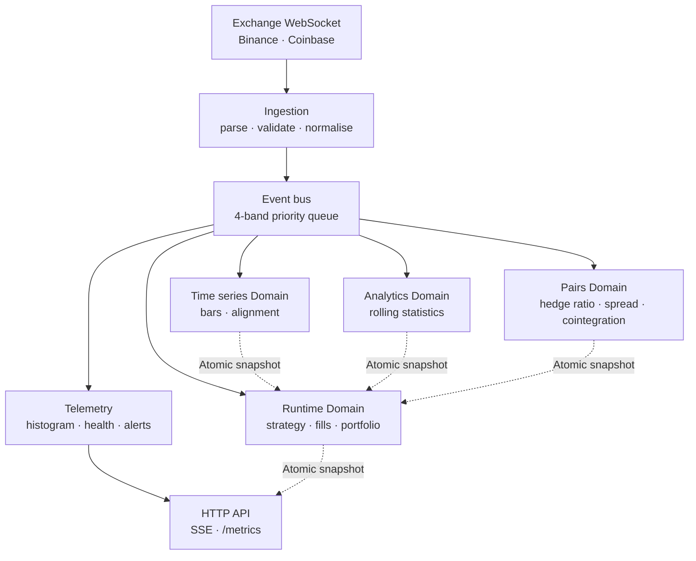

# Data Flow

How a market tick becomes a bar, a z-score, a decision and a simulated fill — and what each stage
is allowed to do.

Paper trading throughout: the final stage simulates against live quotes and reaches no venue.

## The path



Solid arrows are event-bus publication. Dotted arrows are cross-Domain reads of an immutable
snapshot via `Atomic.get` — never a shared mutable structure.

## Stage by stage

### 1. Ingestion

A WebSocket frame arrives. The connector parses it into a typed tick, runs data-quality checks
(sequence gaps, stale timestamps, crossed books), and publishes onto the bus. Failures are counted
per feed rather than raised.

The connection state machine — circuit breaker, reconnect backoff, rate limiting — lives on the Lwt
host. Its state is mirrored into an `Atomic` so telemetry can read it without touching the
connection's own Domain.

### 2. The event bus

`Event_bus.publish` writes into one of four priority bands. Each band is a bounded lock-free ring
buffer, so a full band **drops and counts** rather than blocking — backpressure is visible in
telemetry instead of appearing as unbounded latency.

A single dispatcher Domain drains bands in priority order and invokes matching subscribers.

> **Handlers run synchronously, inline, on the dispatcher Domain.** A handler that does real work
> adds latency to every other subscriber. This constraint shapes every stage below.

### 3. Processors

Each processor follows the same pattern, and it exists because of the constraint above:

```
bus handler (O(1))  →  SPSC queue  →  own Domain drains  →  Atomic.set immutable snapshot
```

The handler does a typed parse, a hashtable membership check against the symbols of interest, and
an enqueue. Nothing else. If the queue is full it drops and increments a counter.

- **Time series** builds bars on an event-time grid, aligns across feeds, and handles late ticks.
- **Analytics** maintains rolling mean, variance and correlation per symbol.
- **Pairs** maintains hedge ratio, spread, z-score and rolling correlation per pair on ticks, and
  re-runs cointegration and half-life on bar closes.

Readers on other Domains call `Processor.snapshot`, which is an `Atomic.get` of a freshly allocated
immutable record. No torn reads, no locks.

### 4. Strategy

The runtime translates bus payloads into `Strategy.Event.t` and assembles a `Context.t` from
processor snapshots — as accessor closures, so nothing is copied.

`on_event` is a pure function of `(state, context, event)` returning `Action.t list`. It does not
submit orders, read the clock, or use randomness. CI enforces the last two: `Clock.now_*` and
`Random.self_init` are banned under `lib/strategy`.

That purity is what makes the backtest meaningful — a strategy that reads the wall clock produces
different decisions on replay than it did live.

### 5. Fill simulation

Actions pass through risk gating and position sizing, then into the same `Backtest.Fill_engine` the
backtester uses: queue position for maker fills, time-in-force, stop and iceberg triggers, venue fee
tiers, slippage, and a latency delay queue.

Fills update the portfolio and publish back onto the bus, where the strategy sees them as events.

**No order reaches a venue.** There is no venue connectivity in the project.

### 6. Observation

Telemetry subscribes like any other processor and records latency inline (about 13 ns per event to
record). The collector aggregates from registered closures, so it depends on no subsystem directly.

The HTTP API reads snapshots by `Atomic.get` — never from the dispatcher Domain — and pushes to the
browser over SSE at 4 Hz.

## Event time, not wall time

Every stage timestamps from the event, not the clock. This is what makes replay exact: feeding a
recorded log through the same pipeline reproduces the original run.

The one consequence worth knowing: **latency is measured as `now - event.timestamp_ns`, which is
only meaningful on a live source.** On a replay it reports the age of the log, so every event
appears to breach the SLA. The daemon publishes its source and disables latency alerting when
replaying; the dashboard greys those cells. External alert rules cannot know, so do not point a
Prometheus scrape at a replay and believe the result.

## The event log

Everything on the bus can be written to an append-only `bin_prot` log with CRC32 per frame. It reads
back with a reader that links none of the runtime, which is what makes `bin/event_replay.exe` and
deterministic fixtures possible.

The audit log is a **separate** module. It shares the framing shape but adds a hash chain and never
truncates on open — see [security](../guides/security.md).

## Where things drop

Every drop is counted, and the counter is the thing to look at when numbers do not add up:

| Stage | Counter | Meaning |
|---|---|---|
| Ingestion | `bus_drops`, `critical_drops` | the bus rejected a publish |
| Bus | `dropped` per band | a ring buffer was full |
| Processor | `dropped_full_queue` | the drain loop fell behind |
| Runtime | `dropped_full_queue` | the strategy Domain fell behind |

`critical_drops` is the one to treat as an incident: the critical band carries data gaps and
circuit-breaker events, so dropping them loses exactly the signal the counter exists to protect.
