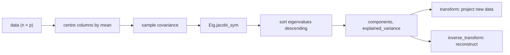

# Advanced Statistical Models Guide

`lib/advanced_models` is the math/statistics toolkit consumed by strategies and the existing
`lib/pairs/` layer. Five user-facing capabilities, two supporting building blocks (special
functions + a small derivative-free optimizer + a symmetric eigendecomposition):

| Capability                    | Module               | Built on                                                    |
| ----------------------------- | -------------------- | ----------------------------------------------------------- |
| Kalman filter for hedge ratio | `Kalman_hedge`       | (closed-form 2×2 algebra)                                   |
| GARCH(1,1) volatility         | `Garch11`            | `Nelder_mead`                                               |
| Ornstein-Uhlenbeck process    | `Ornstein_uhlenbeck` | `Pairs.Ols.regress2`, `Math_utils.FastRandom.normal_sample` |
| Principal Component Analysis  | `Pca`                | `Eig`                                                       |
| Hypothesis-test framework     | `Hypothesis_test`    | `Distribution` → `Special`                                  |

Pure-math utility code — no Domains, no SPSC, no `Atomic.set`. Strategies and the existing
`lib/pairs/` processor call these functions directly and integrate their output into the
established publication contracts.

## No-new-deps stance

We don't pull in `owl`, `lacaml`, or any other math library. The hand-rolled stack:

- `Special` — `erf` / `erfc` (Abramowitz & Stegun 7.1.26), `normal_cdf` / `normal_pdf`,
  `normal_quantile` (Beasley-Springer-Moro), `log_gamma` (Lanczos g=7 with reflection),
  `incomplete_gamma_p` / `incomplete_gamma_q` (Press _Numerical Recipes_ §6.2), and
  `regularized_beta` (Press §6.4 continued fraction). Sufficient for ≤ 2-sig-fig p-values.
- `Nelder_mead` — derivative-free simplex optimizer for small fixed dimensions (≤ 4).
- `Eig.jacobi_sym` — symmetric eigendecomposition via pairwise Givens rotations.

These are the load-bearing primitives; everything else composes from them. The trade-off:
research-grade precision is _not_ claimed (consistent with the existing
`Pairs.Mackinnon_cv` caveat). For higher precision, swap in a dedicated stats library.

## Kalman_hedge — bivariate hedge ratio

The existing `Pairs.Hedge_ratio.Kalman_smoothed` mode smooths the rolling-OLS β estimate
through `Filters.Kalman1d` — useful but **post-hoc**: it filters β values that have already
been corrupted by the rolling OLS window.

`Kalman_hedge` runs a proper bivariate state-space filter:

- State `x = [α, β]ᵀ` (intercept and slope).
- State transition: `x_t = x_{t-1} + w_t`, `w_t ~ N(0, Q)`, `Q = diag(Q_α, Q_β)` (random walk).
- Observation: `y_t = [1, x_obs_t] · x_t + v_t`, `v_t ~ N(0, R)`.

Per-step algebra (all 2×2, closed-form, ~12 flops/step):

- Predict: `x⁻ = x` (random walk); `P⁻ = P + Q`.
- Innovation: `S = P⁻[0][0] + 2·x·P⁻[0][1] + x²·P⁻[1][1] + R`.
- Gain: `K = [(P⁻[0][0] + x·P⁻[0][1])/S, (P⁻[0][1] + x·P⁻[1][1])/S]`.
- Update: `x⁺ = x⁻ + K·(y − H·x⁻)`.
- Covariance: **Joseph form** `P⁺ = (I − K·H)·P⁻·(I − K·H)ᵀ + K·R·Kᵀ` — symmetric and PSD by
  construction.

```ocaml
let kf = AdvancedModels.Kalman_hedge.create
           ~initial_alpha:0.0 ~initial_beta:1.0
           ~initial_cov:10.0
           ~process_var_alpha:1e-7  (* α drifts very slowly *)
           ~process_var_beta:1e-3   (* β can move per tick *)
           ~measurement_var:0.25
           () in
let s = AdvancedModels.Kalman_hedge.update kf ~y ~x in
(* s.alpha, s.beta, s.cov — fresh records on every call *)
```

Follow-up: a separate PR will wire `Kalman_hedge` into `Pairs.Hedge_ratio.beta_mode` as a
fourth mode (alongside `Static` / `Rolling_ols` / `Kalman_smoothed`).

## Garch11 — variance-targeting volatility forecasting

Model: `σ²_t = ω + α·r²_{t-1} + β·σ²_{t-1}`. Long-run variance `σ̄² = ω/(1 − α − β)`.

Two design choices:

1. **Variance targeting**: fix `ω = σ̄²·(1 − α − β)` with `σ̄²` from the sample. The fit
   reduces to two parameters `(α, β)` on the stationarity simplex `α ≥ 0, β ≥ 0, α + β < 1`.
2. **Softmax reparameterization**: optimize over unconstrained `(p₁, p₂)` with
   `α = sigmoid(p₁)·0.999`, `β = sigmoid(p₂)·(0.999 − α)`. The simplex is always satisfied.

Quasi-MLE under Gaussian innovations:
`NLL = ½ Σ (log σ²_t + r²_t/σ²_t)`; optimized by `Nelder_mead` from four starting points
to dodge local minima. The best NLL wins.

```ocaml
match AdvancedModels.Garch11.fit ~returns () with
| Ok r ->
  Printf.printf "ω=%g α=%g β=%g (LL=%g, converged=%b)\n"
    r.params.omega r.params.alpha r.params.beta r.log_likelihood r.converged;
  let online =
    AdvancedModels.Garch11.of_fit r
      ~last_return:returns.(Array.length returns - 1)
      ~last_variance:r.long_run_variance in
  let next_sigma2 = AdvancedModels.Garch11.update online ~r:new_return in
  let multi_step = AdvancedModels.Garch11.forecast online ~horizon:20 in
  (* multi_step.(0) = σ²_{t+1}, ..., multi_step.(19) = σ²_{t+20}
     all decay toward long_run_variance at rate (α + β) per step *)
  ...
| Error `Insufficient_data (have, need) -> ...
| Error `Not_converged -> ...
```

Tests confirm persistence `α + β` is recovered within ±0.1 on 3000 samples of known-DGP
GARCH; individual α / β can fluctuate more on finite samples (well-known).

## Ornstein_uhlenbeck — continuous-time mean reversion

SDE: `dr_t = θ(μ − r_t) dt + σ dW_t`. The discrete-time transition at fixed `Δt` is exact
Gaussian:

- mean: `μ + (r_t − μ)·exp(−θ·Δt)`
- variance: `σ²·(1 − exp(−2θ·Δt))/(2θ)`

Calibration uses `Pairs.Ols.regress2` to fit `r_t = a + b·r_{t-1} + ε` and back out:

- `b = exp(−θ·Δt)` → `θ = −ln(b)/Δt`
- `a = μ·(1 − b)` → `μ = a/(1 − b)`
- `σ² = Var(ε)·2θ/(1 − exp(−2θ·Δt))`

Refuses to claim mean-reversion (``Error `Non_reverting``) if `b ∉ (0, 1)`. Half-life
returned is the continuous-time `ln 2 / θ`.

```ocaml
match AdvancedModels.Ornstein_uhlenbeck.fit ~series ~dt:1.0 with
| Ok r ->
  Printf.printf "θ=%g μ=%g σ=%g half_life=%g\n"
    r.params.theta r.params.mu r.params.sigma r.half_life;
  let next = AdvancedModels.Ornstein_uhlenbeck.expected_value r.params
               ~r0:current_value ~t:1.0 in
  ...
| Error `Non_reverting -> ...

(* Simulate trajectories for backtesting / Monte Carlo *)
let path =
  AdvancedModels.Ornstein_uhlenbeck.simulate r.params
    ~n:1000 ~dt:0.1 ~seed:42 ~r0:0.0
```

Conceptually overlaps with `Pairs.Mean_reversion.half_life` — that one returns the
discrete-time AR(1) half-life on residuals; `Ornstein_uhlenbeck` adds full parameter
recovery and the continuous-time framing.

## Pca — factor analysis



`Pca.fit` centres input columns by their mean, computes the unbiased sample covariance
matrix, and diagonalizes it via `Eig.jacobi_sym`. Components are returned in descending
order of explained variance. Optional `~n_components` truncates to the top k.

```ocaml
let pca = AdvancedModels.Pca.fit ~data ~n_components:5 () in
let proj = AdvancedModels.Pca.transform pca ~data:new_obs in
let recon = AdvancedModels.Pca.inverse_transform pca ~projected:proj in
(* At full rank, recon ≡ new_obs bit-exact. *)

let evr = AdvancedModels.Pca.explained_variance_ratio pca in
(* evr.(0) + evr.(1) + ... = fraction of variance retained by the top k *)
```

Use cases: factor analysis over symbol baskets (top components capture market /
sector / idiosyncratic risk), dimensionality reduction for downstream regression, and
covariance regularization.

## Hypothesis_test — seven tests, one result type

```ocaml
type result = { name : string; statistic : float; p_value : float; dof : float option }
val reject : result -> alpha:float -> bool
```

| Test                                  | When to use                                      | Distribution under H₀        |
| ------------------------------------- | ------------------------------------------------ | ---------------------------- |
| `one_sample_t ~sample ~mu0`           | Is the sample mean = `mu0`?                      | `Student_t(df = n − 1)`      |
| `two_sample_t ~a ~b`                  | Are the two sample means equal?                  | Welch t (default) / pooled t |
| `chi_squared_gof ~observed ~expected` | Goodness of fit to a multinomial                 | `Chi_squared(df = k − 1)`    |
| `ks_one_sample ~sample ~cdf`          | Is the sample drawn from `cdf`?                  | Kolmogorov                   |
| `ks_two_sample ~a ~b`                 | Same distribution?                               | Kolmogorov (effective n)     |
| `jarque_bera ~sample`                 | Is the sample normally distributed?              | `Chi_squared(df = 2)`        |
| `ljung_box ~residuals ~lags`          | Are model residuals autocorrelated up to `lags`? | `Chi_squared(df = lags)`     |
| `runs_test ~sample`                   | Are signs around the sample mean random?         | `Normal` (asymptotic)        |

Coarse-precision caveat: p-values are computed via the rational approximations in `Special` →
`Distribution`. Claim no more than two significant figures. For research-grade precision, use
a dedicated stats package and surface their p-values through this same `result` shape.

## Tests + benchmarks

```bash
# All 10 suites
dune runtest test/advanced_models

# Lint
make adv-clock-lint

# Bench (Apple Silicon release: Kalman_hedge ~17.7M ev/s, Garch11 ~26.2M ev/s,
#        PCA 32x500 ~1.3ms)
make adv-bench
```

The bench (`test/performance/advanced_models_throughput.exe`) is registered in
`.github/workflows/benchmark.yml` and posts to the gh-pages dashboard. Regression floors:
500k ev/s for both online paths, 500 ms ceiling on PCA fit.

