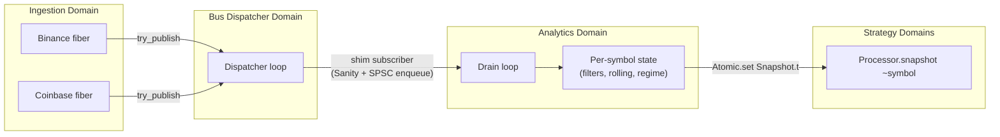

# Statistical Data Processing Guide

`lib/analytics` is the layer that consumes raw `Market_tick` and `Trade_print` events from the
event bus and produces denoised, validated, regime-aware per-symbol stats that strategies can
poll. It sits between market-data ingestion and the statistical-arbitrage strategies.

## Concurrency model



- **Three Domains**: Bus Dispatcher (lock-free PQ), Ingestion (Lwt fibers), Analytics (this layer).
- The bus shim subscriber does only `Sanity.check` + `SPSCQueue.enqueue` — it returns in O(1)
  so it cannot stall the dispatcher.
- The Analytics Domain owns all per-symbol mutable state and is the sole writer.
- Cross-Domain reads from strategies use `Processor.snapshot ~symbol`, which calls
  `Atomic.get` on an immutable `Snapshot.t` published by the Analytics Domain. No torn reads,
  no per-field atomicity dance — the `Atomic.set`/`Atomic.get` release-acquire pair covers the
  whole record because the published value is itself immutable.

## What the layer produces

For every active symbol, the layer maintains:

| Field                                      | Source                                 | Notes                                                                       |
| ------------------------------------------ | -------------------------------------- | --------------------------------------------------------------------------- |
| `last_price`                               | most recent valid tick                 | filtered through Sanity + Z-score                                           |
| `denoised_price`                           | `Filters.Kalman1d`                     | local-level model with auto-bootstrapped Q/R                                |
| `realized_vol`                             | `Volatility.Realized`                  | rolling-window stddev of log-returns                                        |
| `ewma_vol`                                 | `Volatility.Ewma`                      | streaming, with RiskMetrics-style bias correction                           |
| `rolling_mean_price` / `rolling_std_price` | `Rolling.Rolling_mean` / `Rolling_var` | periodic full-recompute every K ticks (avoids sliding-Welford cancellation) |
| `drawdown_from_peak`                       | rolling peak tracker                   | of denoised price                                                           |
| `regime`                                   | `Regime.detector`                      | `Calm \| Trending \| Volatile \| Crisis`, asymmetric dwell-time hysteresis  |
| `rejected_count`                           | outlier pipeline                       | lifetime count of dropped ticks                                             |
| `ready`                                    | composite                              | true once every estimator's bias-correction weight has converged            |

Strategies poll on tick:

```ocaml
let snap = Algostream_analytics.Processor.snapshot proc ~symbol:"BTCUSDT" in
if snap.ready && snap.regime = Regime.Calm then
  (* … run mean-reversion entry logic … *)
```

## Numerical correctness

Three load-bearing decisions:

1. **Periodic full recompute for sliding-window stats.** Naïve sliding-Welford (subtract the
   outgoing point's contribution from M2) suffers catastrophic cancellation on long-running
   streams. `Rolling_var` / `Rolling_cov` / `Rolling_corr` keep the most recent N samples in a
   circular buffer and run a full O(N) recompute every `recompute_every` ticks
   (`= max 8 (window/16)` by default). Between recomputes an incremental update is applied for
   cheap reads; the contract is "exact at recompute boundaries, bounded-error in between."
2. **EWMA bias correction.** A fresh EWMA with α = 2/(period+1) is heavily biased on the first
   ~3·period samples. `Filters.Ewma` carries `s_t` _and_ a normalization weight
   `w_t = α + (1-α)·w_{t-1}` and reports `s_t / w_t`; `Filters.Ewma.ready` is true once
   `w_t ≥ 0.95`. Same trick on `Filters.Ewma_var`.
3. **Sanity-first outlier pipeline.** `Sanity` rejects non-finite, zero, or negative
   prices/sizes BEFORE any moment-based filter sees them. This is what prevents NaN propagating
   forever through EWMA/Kalman/Welford.

## Determinism

The analytics path reads time **only** from `tick.timestamp_ns` — never `Unix.gettimeofday`,
never `Clock.now_*`. This makes `event_replay.exe` produce bit-for-bit identical Snapshots on
every run of the same fixture, which is what makes backtests reproducible.

Enforced by:

- `make analytics-clock-lint` — local check
- `.github/workflows/ci.yml` lint step — fails CI on any wall-clock leak

The unit test `test/analytics/test_determinism.ml` runs the same fixture stream twice and
asserts the final snapshots are field-equivalent.

## Backpressure

- Bus → analytics: bus shim subscriber drops + counts when the SPSC handoff queue (cap 65 536) is
  full. Counter exposed via `Processor.stats.ticks_dropped_full_queue`.
- Bus dispatcher → all subscribers: serialized; if your handler is slow it taxes everyone. Our
  shim is intentionally O(1) so it never does.
- `try_publish` from inside the analytics path: returns `false` on Critical-band overflow, falls
  through to `Logs.err`, so an alert is never silently lost.

## Stale-symbol GC

`Per_symbol.t` instances are born lazily on first tick. The `Processor` keeps an LRU cap of
`Config.t.max_active_symbols` (default 256); when exceeded, the symbol with the oldest
`last_event_ts_ns` is evicted. Querying a GC'd symbol returns `Snapshot.empty ~symbol` rather
than crashing.

## Reference numbers

On Apple Silicon (release profile, `make analytics-bench`):

- **Direct call rate** (`Per_symbol.on_tick` in a tight loop): ≈ 39 000 ev/s, ≈ 25 µs / tick.
- **Through-bus rate** (50 k events published into bus, drained by Analytics Domain):
  ≈ 37 000 ev/s, 0 dropped at the SPSC handoff.

The 50 k events/sec SLA is for _ingestion_ (raw parser → bus); ingestion benches show
~427 k ev/s for Binance / ~350 k for Coinbase. The analytics layer sits a layer below and runs
plenty fast for real market rates (Binance is ~10 k ev/s on a busy crypto pair).

The bench fails CI if direct throughput drops below 20 k ev/s — that's a **regression detector**,
not the absolute floor. Tighten as the layer is optimized.

## Adding a custom outlier filter

Filters implement the `FILTER` module type:

```ocaml
module type FILTER = sig
  type t
  val name : string
  val update : t -> float -> Outlier.verdict
end
```

`Outlier.run` chains them left-to-right; first `Reject` short-circuits. The default v1 pipeline
is `Sanity → Z_score`; `Hampel` is constructed but kept off the hot path (its O(window log
window) median/MAD recompute every tick was the bench bottleneck).

To use Hampel for a paranoid feed, build a custom pipeline by reaching into
`Per_symbol.create` and constructing the runner list yourself.

## Known gaps / follow-ups

- **Cross-symbol rolling correlation** is wired (`Rolling.Rolling_corr`) but `Processor.correlation
~a ~b` returns 0.0 — that needs a shared cross-pair state table the strategy layer would own.
- **Kalman parameter recalibration** runs on first transition into the regime detector only.
  Periodic event-time recalibration is not implemented.
- **Snapshot/restore** for hot-reload (round-trip `bin_prot` of `Per_symbol.t`) is in the plan
  but deferred — no strategy currently needs it.
- **Per-symbol Domain sharding** is a future scale-out: today a single Analytics Domain drains
  all symbols. Hash-shard symbol → N Domains when one Domain isn't enough.

## Source map

| Module                                    | Path                                       |
| ----------------------------------------- | ------------------------------------------ |
| Top-level facade                          | `lib/analytics/processor.{ml,mli}`         |
| Per-symbol orchestration                  | `lib/analytics/per_symbol.{ml,mli}`        |
| Immutable snapshot                        | `lib/analytics/snapshot.{ml,mli}`          |
| Filters (Sanity / EWMA / Kalman / Median) | `lib/analytics/filters.{ml,mli}`           |
| Rolling stats                             | `lib/analytics/rolling.{ml,mli}`           |
| Outlier pipeline                          | `lib/analytics/outlier.{ml,mli}`           |
| Volatility                                | `lib/analytics/volatility.{ml,mli}`        |
| Regime detector                           | `lib/analytics/regime.{ml,mli}`            |
| Tick conversion                           | `lib/analytics/tick_event.{ml,mli}`        |
| Config                                    | `lib/analytics/config.{ml,mli}`            |
| Tests                                     | `test/analytics/`                          |
| Throughput bench                          | `test/performance/analytics_throughput.ml` |
