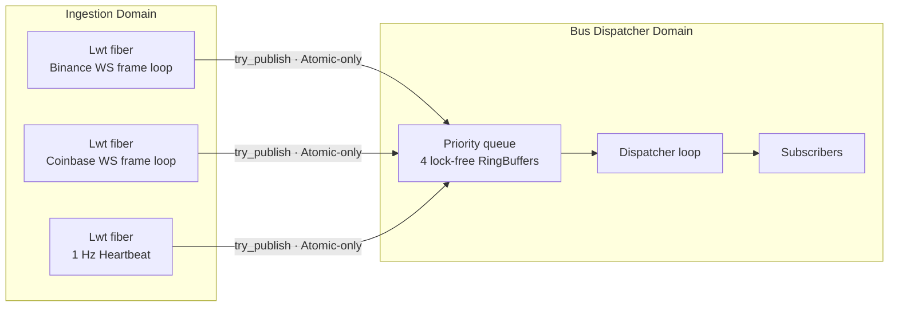
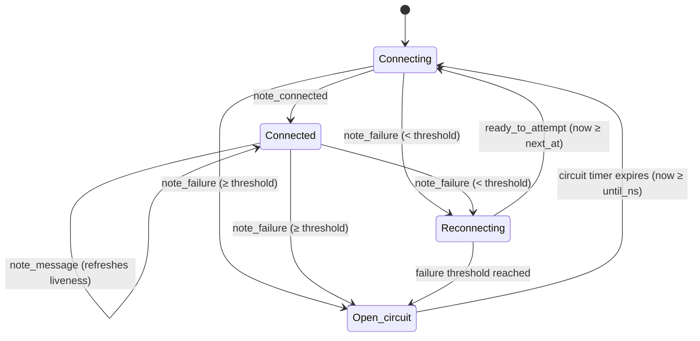

# Data Ingestion Guide

AlgoStream brings live market data into the event bus. This guide covers the runtime
model, configuration, and how to extend the system to a new exchange.

## What's in the box

`lib/data_ingestion/` is a single library that coordinates all market-data input. The two
shipped exchanges are:

| Library | Endpoint | Channels |
|---|---|---|
| `algostream.data_ingestion.binance` | `wss://stream.binance.com/ws` | `<sym>@bookTicker`, `<sym>@trade` |
| `algostream.data_ingestion.coinbase` | `wss://ws-feed.exchange.coinbase.com` | `ticker`, `matches` |

> **Why the older Coinbase Exchange WS?** The newer Advanced Trade WebSocket
> (`advanced-trade-ws.coinbase.com`) requires JWT authentication even for *public* market data.
> AlgoStream uses public market data only, so this is the public Exchange WS feed.

## Concurrency model



A **single dedicated `Domain.t`** hosts `Lwt_main.run`, and that's the only `Lwt_main.run` site
in the project (CI greps to enforce this). All exchange connectors share that one Lwt scheduler;
each connection is one Lwt fiber. The bus's dispatcher Domain runs entirely without Lwt — the only
cross-Domain interaction is the lock-free `Event_bus.try_publish`.

`Lwt_engine` keeps process-global state, so running `Lwt_main.run` from two Domains corrupts
silently. The supervisor's `start` raises immediately on duplicate calls.

## Lifecycle

```ocaml
open Algostream_data_ingestion
open Algostream_common_config

let bus = Algostream_infrastructure_event_bus.Event_bus.create () in
Algostream_infrastructure_event_bus.Event_bus.start bus;

let entries =
  Ingestion_supervisor.[
    { em = (module Algostream_data_ingestion_binance.Connector);
      config = Exchange_config.binance_default ~symbols:["BTCUSDT"; "ETHUSDT"] };
    { em = (module Algostream_data_ingestion_coinbase.Connector);
      config = Exchange_config.coinbase_default ~symbols:["BTC-USD"; "ETH-USD"] };
  ]
in
let supervisor = Ingestion_supervisor.start ~bus ~entries () in

(* ... do work, subscribe to the bus, etc. ... *)

let stats = Ingestion_supervisor.stop supervisor in
List.iter (fun s ->
  Printf.printf "[%s] gaps=%d stale=%d crossed=%d bus_drops=%Ld\n"
    s.Ingestion_supervisor.exchange
    s.data_quality.sequence_gaps
    s.data_quality.stale_ticks
    s.data_quality.crossed_books
    s.bus_drops
) stats
```

## URI scheme resolution, and a bug worth knowing about

Conduit resolves a URI by looking its **scheme up as a service**, through `getservbyname` and then
`Uri_services`. Neither knows `ws` or `wss` — they are not in `/etc/services` — so
`Resolver_lwt_unix.system` returned `Unknown "unknown scheme"` for every endpoint in
`Exchange_config`, and **no connector ever established a connection**. The supervisor did exactly
what it should: reported the failure and retried, forever. The symptom was therefore an endless
reconnect loop and a feed that produced nothing but heartbeats, not a crash.

`connector_runtime.ml` builds its own resolver registering the two WebSocket schemes with their
well-known ports and TLS flag:

```ocaml
let websocket_service = function
  | "ws"  -> Lwt.return_some { Resolver.name = "ws";  port = 80;  tls = false }
  | "wss" -> Lwt.return_some { Resolver.name = "wss"; port = 443; tls = true }
  | _     -> Lwt.return_none
```

An explicit port in the URI still wins, so Binance's `:9443` endpoint is unaffected — the service
port is only consulted when the URI omits one.

Two things this depends on that are easy to lose:

- **A TLS backend must be linked.** `Conduit_lwt_unix.tls_library` reports `OpenSSL`, `Native`
  (ocaml-tls) or `No_tls`; with `No_tls` every `wss://` connection fails regardless of the above.
- **CA certificates must exist in the runtime image.** This is why `ca-certificates` is installed in
  the release container's final stage rather than only the build stage.

If a feed reports `observed=0` with a healthy-looking process, run
`dune exec bin/ingest.exe -- --exchange coinbase --symbols BTC-USD --duration 20 --print-events` and
read the first line: a connector that cannot resolve its endpoint says so there.

## Connection state machine

Per-connection (`Connection_supervisor`):



- **Backoff**: exponential 1s, 2s, 4s, 8s, 16s, 30s cap with ±25% jitter.
- **Circuit breaker**: opens after `circuit_breaker_threshold` (default 5) consecutive failures,
  pauses retries for `circuit_open_ms` (default 60s).
- **Liveness**: `read_timeout_ms` (default 30s) of silence forces a reconnect.
- **Risk_alert dedup**: same `(code, symbol)` pair fires at most once per 30s to avoid flap-spam.

## Backpressure & data quality

Verdict types from `Data_quality.check_market_tick` / `check_trade_print`:

| Verdict | What happens |
|---|---|
| `Ok_publish` | tick is forwarded to `Event_bus.try_publish` |
| `Drop_stale` | tick is dropped, High Risk_alert published |
| `Drop_crossed` | tick is dropped, High Risk_alert published |
| `Out_of_order` | trade is forwarded, but counter increments + Risk_alert |
| `Gap_then_publish` | **Critical-priority `Data_gap` event published BEFORE the tick**, then the tick is forwarded |

When `try_publish` returns `false` (priority band full), the per-(exchange, symbol) drop counter
increments and the message is silently lost — except for **Critical-priority events**, where the
fall-through is a synchronous `Logs.err` plus an atomic `critical_drops` counter. The aim is for
gap signals to never be lost.

A periodic 1Hz `Heartbeat` event at Low priority gives consumers a presence ping.

### What a gap counter needs to be counting

`Gap_then_publish` and the `dropped_to_gap` metric only mean something if the value handed to the
detector is a **per-symbol counter that advances by exactly one per message the connector actually
receives**. `check_market_tick` and `check_trade_print` take `int64 option`; `None` disables gap
detection, which is what both tick streams pass, because neither exchange numbers its quote
updates.

Both feeds got this wrong at first, and the failure was silent in the worst way — nothing errored,
the metric just quietly reported nonsense:

| Feed | Was passing | Effect |
|---|---|---|
| Coinbase `match` | the message's `sequence` field | counts the product's whole **full** channel (order opens, changes, cancels) while the connector subscribes only to matches, so consecutive matches are far apart |
| Binance `@trade` | `T`, the trade **timestamp in milliseconds** | the "dropped" count was the elapsed time between trades — two trades half a second apart read as 499 lost messages |

Both now pass the exchange's per-symbol **trade id**, which is dense over exactly the messages
received. Measured over an hour of Coinbase BTC-USD before the fix: `dropped_to_gap=2096488`
against `observed=25706`. After, on a live 90-second capture of the same two products:
`gaps=0 dropped_to_gap=0` against `observed=880`.

If you add a connector, this is the contract to check first. A sparse counter does not fail loudly;
it produces a large number that looks like a serious data-quality problem and is not one.

## Allocation budget

The current parser uses `Yojson.Safe.from_string`, which materializes a full AST per frame
(~200-300 bytes per Binance bookTicker, ~290 bytes per Coinbase ticker). Throughput on Apple
Silicon is **~427k ev/s for Binance, ~349k ev/s for Coinbase** — far above the 50k SLA. The
[`test/performance/ingestion_alloc.ml`](../../test/performance/ingestion_alloc.ml) bench sets a
600 word/event regression ceiling; the next optimization will replace the hot path with a
hand-rolled `Bytes.t` skip-to-key state machine targeting ~16 words/event (1 envelope, 1 payload
variant, 1 trade_id, plus interned symbol).

## Adding a new exchange

1. Implement `Algostream_data_ingestion.Exchange.S`:
   ```ocaml
   val name : string
   val build_subscribe_message : symbols:string list -> string
   val parse_frame :
     symbol_intern:Algostream_data_ingestion.Symbol_intern.t ->
     string ->
     Algostream_infrastructure_event_bus.Event_types.Event.payload list
   ```
2. Add a default `Exchange_config.<name>_default` builder in `lib/common/config/exchange_config.ml`
   pointing at the public WS endpoint(s).
3. Recognize the new exchange in `bin/ingest.ml`'s `resolve_entries`.
4. Add unit tests for the parser in `test/data_ingestion/`.

## Symbol normalization

Each exchange uses its own symbol convention; the supervisor passes the configured strings through
verbatim. Naming has not been normalized — for now, callers supply the exchange-native form:

| Exchange | Format |
|---|---|
| Binance | `BTCUSDT`, `ETHUSDT` (uppercase, no separator) |
| Coinbase | `BTC-USD`, `ETH-USD` (uppercase, dash) |

A unified `(base, quote)` symbol type living in the domain layer is tracked under
*Data Normalization & Quality*.

## Known gaps / follow-ups

- **No live timestamp from Binance bookTicker**: the Binance feed doesn't ship a server timestamp on
  BBO updates, so ingest time is used instead. Trade frames carry `T`, used for both
  `payload.timestamp_ns` and the sequence field.
- **ISO-8601 timestamps from Coinbase**: parsed only as ingest time today. Adding `ptime` would
  would recover the exchange-side microsecond precision.
- **Hot-path JSON parser**: see *Allocation budget* above. The yojson AST cost is the largest
  performance lever if throughput falls below target under realistic traffic.
- **Symbol fan-out**: per-band capacity is shared across symbols. v1 is comfortable up to ~16
  symbols total; for higher fan-out, raise `capacity_per_band` or shard by exchange.
- **TLS hardening**: relies on the system trust store via `tls-lwt`; explicit pin/SNI per exchange
  host is a future improvement.

## Source map

| Module | Path |
|---|---|
| Public payloads (`Trade_print`, `Data_gap`) | `lib/infrastructure/event_bus/event_types.{ml,mli}` |
| Top-level supervisor | `lib/data_ingestion/ingestion_supervisor.{ml,mli}` |
| Per-connection state machine | `lib/data_ingestion/connection_supervisor.{ml,mli}` |
| WebSocket loop | `lib/data_ingestion/connector_runtime.{ml,mli}` |
| Token bucket | `lib/data_ingestion/rate_limiter.{ml,mli}` |
| Quality monitors | `lib/data_ingestion/data_quality.{ml,mli}` |
| Symbol interner | `lib/data_ingestion/symbol_intern.{ml,mli}` |
| Binance | `lib/data_ingestion/binance/{connector,parser}.ml` |
| Coinbase | `lib/data_ingestion/coinbase/{connector,parser}.ml` |
| Per-exchange config | `lib/common/config/exchange_config.{ml,mli}` |
| CLI | `bin/ingest.ml` |
| Unit tests | `test/data_ingestion/` |
| Perf benches | `test/performance/{ingestion_throughput,ingestion_alloc}.ml` |
