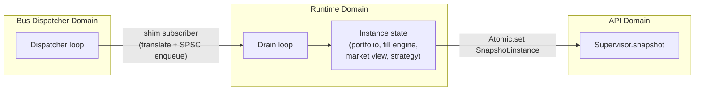

# Live Runtime Guide

The live runtime is the piece the backtest layer deliberately left out: something that drives a `Strategy.S` against
the live event bus. This guide covers what it does, what it does **not** do, and why it reuses the
backtest engine's machinery instead of growing a parallel execution path.

## Paper trading, stated plainly

**No order ever reaches a venue.** There is no order placement anywhere in this repository — no API
keys, no HMAC request signing, no trading endpoint. The only bytes the ingestion layer writes to a
socket are a WebSocket subscribe message, a pong, and a close.

Fills are simulated against live quotes by `Backtest.Fill_engine`. Every P&L figure the dashboard
shows is therefore hypothetical, and the API says so in its payload:

```json
{ "mode": "paper" }
```

Connecting this to a real venue would need order submission, authentication, reconciliation and a
kill switch, none of which exist. Do not treat the numbers as trading results.

## Reuse stance

| Need | Where it came from |
|---|---|
| Order matching, TIF, stops, queue-position maker fills | `Backtest.Fill_engine` |
| Fee tiers, financing accrual | `Backtest.Cost_model` |
| Regime-scaled slippage, permanent impact | `Backtest.Slippage` |
| Market state behind the strategy's accessors | `Backtest.Market_view` |
| Pre-trade risk gate | `Risk_management.Risk_limits.pre_trade_check` |
| Cointegration, spread, hedge ratio | `Pairs.Per_pair`, driven inline |
| Bars for `Event.Bar` and the cointegration retest | `Time_series.Bar_builder` |

Nothing in that list was written for the live runtime. It is composition, not new execution logic —
and that is what makes the two drivers comparable.

## The contract that justifies the design

`lib/strategy/dune` says the layer *"deliberately depends on neither `algostream.backtest` nor
`algostream.infrastructure.event_bus`: a live runner must be able to implement `Strategy.S` without
linking the fill simulator."* `Action.t` is **returned** by `on_event` rather than submitted,
precisely so order-id assignment, the risk gate and routing stay outside the strategy.

`test/runtime/test_parity.ml` is the test that makes this real: one strategy, one record sequence,
driven through `Runtime.Instance` and through `Backtest.Engine` with identical configuration. The
fills, the counters and the final NAV must agree exactly.

If they ever diverge, every backtested number in the project becomes a claim about a system that
does not exist. That is why the test is in the runtime suite rather than the backtest suite — it is
the runtime's obligation to keep up.

## Threading

An instance is driven by exactly one Domain — the supervisor's drain loop — so its internal state is
ordinary mutable state with no synchronisation. Everything crossing a Domain boundary goes through
an `Atomic.t`:



The bus handler does the minimum the dispatcher can afford — translate the payload and enqueue —
because `Event_bus` invokes handlers **synchronously, inline, on the single dispatcher Domain**. A
slow subscriber adds latency to every other subscriber and eventually backs the ring up until
`try_publish` starts returning `false`.

## Lifecycle

| State | Market data | Strategy consulted | Resting orders |
|---|---|---|---|
| `Running` | processed | yes | keep filling |
| `Paused` | processed | **no** | keep filling |
| `Stopped` | ignored | no | cancelled |

Pausing does **not** freeze the world. The market view and fill engine keep advancing, because
orders already resting at a venue keep filling whether or not you are watching — that is what a real
paused strategy experiences. What stops is emission: `on_event` is not called, so no new orders
appear. Resuming continues from the same state rather than restarting; the strategy's own counters
never rewound.

Control calls are safe from any Domain. They set atomics the drain loop reads, and `Instance.snapshot`
overlays them at read time so a pause is visible immediately — including on a feed that has gone
quiet, which is exactly when you are most likely to be pausing something.

## Allocation

`allocation` is advisory. It is reported, and a strategy may size against it, but the fill engine
does not enforce it — a strategy that ignores its allocation will still trade. Hard enforcement
belongs with the risk limits, which do reject at the gate.

## Known gaps / follow-ups

- **No venue connectivity.** See above. This is the largest gap and it is deliberate.
- **`Replace` is a cancel.** `Fill_engine` has no amend, so `Action.Replace` cancels and the
  strategy must re-submit. Stated rather than silently approximated.
- **No risk monitor attached.** `Context.risk` is `None`: `Risk_management.Monitor` is push-driven
  and the runtime does not yet feed it, so strategies cannot read a live risk snapshot. The
  pre-trade gate does run.
- **One strategy per pair configuration.** The daemon starts a single instance; the supervisor
  supports many, but nothing wires more than one from the CLI yet.
- **Timers are ignored.** `Action.Set_timer` and `Strategy.Timer_every` are accepted and dropped;
  the runtime has no scheduler.

## Source map

| Module | Path |
|---|---|
| Bus payload to market record | `lib/runtime/translate.{ml,mli}` |
| One live strategy | `lib/runtime/instance.{ml,mli}` |
| Many instances, bus attachment, controls | `lib/runtime/supervisor.{ml,mli}` |
| Published state | `lib/runtime/snapshot.{ml,mli}` |
| Live-vs-backtest parity | `test/runtime/test_parity.ml` |
| Lifecycle and bus integration | `test/runtime/test_supervisor.ml` |
| Daemon | `bin/algostream.ml` |

## Scope and limitations

Start/stop/pause, allocation and risk-limit configuration are served by `Runtime.Supervisor` and
exposed over the API.

**Strategy comparison tooling remains offline** — it lives in `lib/optimization` and is not wired
into the live runtime.
