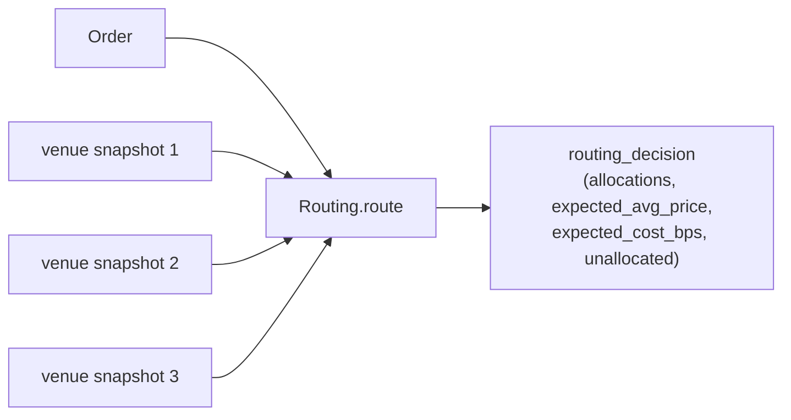

# Order Management System Guide

`lib/order_management` is the layer that turns strategy signals into actual orders: pick a
venue, size the position, walk the book to estimate impact, then analyze execution quality
post-trade. Six modules:

| Module              | Purpose                                                                                 |
| ------------------- | --------------------------------------------------------------------------------------- |
| `Venue`             | Typed venue (fee tiers, supported kinds, latency) replacing untyped `exchange : string` |
| `Order_state`       | Explicit state-machine helpers on top of `Domain.Order.order_status`                    |
| `Position_sizing`   | Kelly (full / fractional / discrete) + volatility scaling + ATR                         |
| `Routing`           | SOR across venue snapshots with three strategies                                        |
| `Execution_quality` | Post-trade TCA report (slippage / VWAP-diff / IS / timing)                              |
| `Book_impact`       | Walk-the-book + Almgren square-root permanent impact                                    |

Pure functions — no Domain ownership, no SPSC, no `Atomic.set`. Strategies own state and
pass values through. Same architectural shape as `lib/advanced_models/`.

## Reuse stance

Order types (Market / Limit / Stop / Stop_limit / Iceberg) were already implemented in
`lib/domain/orders/order.ml` before this library existed. The "build order types" requirement is
satisfied by that existing variant — this library doesn't duplicate it. Instead it adds the
missing state-machine accessors (`Order_state.is_terminal`, `is_active`, `can_transition`,
`transition`) which formalize the transition table that `Domain.Order` left implicit.

Similarly, `Trade.Trade_aggregation.execution_quality` already had slippage and
implementation-shortfall formulas — `Execution_quality` wraps them into a richer per-order
report with timing fields and fill_rate. `Order_book.order_book` already had `depth_at_price`
and `imbalance` — `Book_impact` walks the levels and produces the avg-fill-price estimate.

## End-to-end worked example

```ocaml
open Algostream_order_management
open Algostream_domain_orders
open Algostream_domain_market

(* 1. Strategy generates an edge estimate from upstream layers (Pairs + GARCH). *)
let mean_return = 0.05      (* per-period expected return *)
let variance = 0.04         (* per-period variance from GARCH *)

(* 2. Size via fractional Kelly. *)
let kelly_f =
  Position_sizing.Kelly.fractional ~mean:mean_return ~variance ~fraction:0.25
(* kelly_f ≈ 0.3125; cap-pct guard against over-betting *)

let shares =
  Position_sizing.Kelly.size_position ~capital:100_000.0
    ~kelly_fraction:kelly_f ~price:100.0 ~cap_pct:0.5 ()
(* shares = 312.5 (under the 0.5 cap of 500) *)

(* 3. Build the order. *)
let order =
  Order.create_market_order ~id:"o-1" ~client_order_id:"c-1"
    ~symbol:"BTCUSDT" ~side:Order.Buy ~quantity:shares
    ~exchange:"" (* will be set after routing *) ()

(* 4. Route across venues. *)
let snapshots =
  [ Routing.{ venue = Venue.binance_spot;
              best_bid = 50_000.0; best_ask = 50_010.0;
              bid_depth = 5_000.0; ask_depth = 5_000.0; monthly_volume = 1_000_000.0 };
    Routing.{ venue = Venue.coinbase_advanced;
              best_bid = 50_005.0; best_ask = 50_015.0;
              bid_depth = 2_000.0; ask_depth = 2_000.0; monthly_volume = 500_000.0 } ]

let decision =
  Routing.route ~order ~venues:snapshots ~strategy:Routing.Smart_split ()
(* decision.allocations: which venue gets what quantity at what expected price + fee *)

(* 5. Pre-trade book impact sanity check on the primary venue's book. *)
let impact_estimate =
  Book_impact.estimate_from_book ~side:Order.Buy ~quantity:shares
    ~book:(* the local book for the primary venue *) ...

(* 6. (... submit via bus events, wait for fills, then ...) *)

(* 7. Post-trade TCA. *)
let fills =
  [ Execution_quality.{ ts_ns = 1_000_000L; price = 50_012.0; quantity = 200.0;
                        venue = "binance_spot"; commission = 5.0 };
    Execution_quality.{ ts_ns = 1_500_000L; price = 50_015.0; quantity = 112.5;
                        venue = "binance_spot"; commission = 3.0 } ]

let report =
  Execution_quality.analyze ~order ~decision_price:50_010.0 ~decision_ts_ns:0L
    ~fills ~market_vwap:50_013.0
(* report.slippage_bps, report.implementation_shortfall_bps, report.fill_rate, ... *)
```

## Venue model

```ocaml
type fee_tier = {
  maker_bps : float;
  taker_bps : float;
  volume_threshold : float;  (* monthly notional *)
}

type t = {
  name : string;
  asset_class : Asset.asset_class;
  fee_tiers : fee_tier list;     (* sorted ascending *)
  base_latency_us : float;
  supports_iceberg : bool;
  supports_stop : bool;
  min_order_size : float;
}
```

Default constructors: `Venue.binance_spot` (10/10 bps, supports iceberg + stop) and
`Venue.coinbase_advanced` (60/80 bps, stop only — Coinbase Advanced Trade doesn't expose
iceberg natively).

`effective_fee_bps t ~taker ~monthly_volume` walks `fee_tiers` and picks the active tier.
Pure function; no I/O.

## Routing strategies



| Strategy         | What it does                                                                                                                                                   |
| ---------------- | -------------------------------------------------------------------------------------------------------------------------------------------------------------- |
| `Cheapest_venue` | Single-venue route to the lowest-fee venue (regardless of price). Use for cost-sensitive flow on liquid symbols.                                               |
| `Best_price`     | Single-venue route to the tightest quote on the order's side. Use when price > fees in your cost budget.                                                       |
| `Smart_split`    | Multi-venue: sort by `(price + taker_fee_bps · 1e-4)` ascending; walk depth until quantity is met. Reports `unallocated` if no venue covers the rest. Default. |

Filter pre-applied: venues that don't support the order's kind (e.g., iceberg on Coinbase
Advanced) are excluded. If no eligible venue, `decision.unallocated = order.quantity` and
`decision.allocations = []`.

## Position sizing math

**Kelly (continuous returns)**: `f* = mean / variance`. With `mean=0.05, variance=0.04`,
`f* = 1.25`. Real-world sizing caps this — `size_position ~cap_pct:1.0` would still convert
1.25 into 1.0 (100% capital) before computing shares. Reduce with `fractional ~fraction:0.25`
for the typical "quarter Kelly" practice (reduces variance ~93% while sacrificing only ~25%
of geometric growth).

**Kelly (discrete bets)**: `from_winrate ~win_prob ~win_loss_ratio` returns `p − q/b`. For
60% win rate with 2:1 odds: `0.6 − 0.4/2 = 0.4`. No edge → 0.

**Volatility scaling**: `size = target_vol_dollars / (price · asset_vol_decimal)`, capped
at `capital / price` (100% exposure). Targets a per-period dollar volatility on the
position, decoupled from instrument vol.

**ATR sizing**: `shares = (capital · risk_pct) / atr`. Risks `risk_pct` of capital under a
stop placed `atr` units from entry. Capped at `capital / price`.

## TCA report

The `analyze` function takes:

- `order` — the original order (for total quantity, side)
- `decision_price` — the price at which the strategy decided to trade
- `decision_ts_ns` — the timestamp at which the strategy decided (for latency)
- `fills` — list of partial fills with `ts_ns, price, quantity, venue, commission`
- `market_vwap` — VWAP of the market over the fill window (caller computes from market data)

And produces:

| Field                          | Meaning                                                             |
| ------------------------------ | ------------------------------------------------------------------- |
| `fill_rate`                    | filled / ordered ∈ [0, 1]                                           |
| `avg_fill_price`               | size-weighted average                                               |
| `slippage_bps`                 | (avg_fill − decision) / decision · 1e4, signed (positive = adverse) |
| `vwap_diff_bps`                | (avg_fill − market_vwap) / market_vwap · 1e4, signed                |
| `implementation_shortfall_bps` | \|slippage\| + commission_bps                                       |
| `time_to_full_fill_ns`         | `Some t` iff `fill_rate = 1.0`                                      |
| `first_fill_latency_ns`        | first fill ts − decision ts                                         |

Signed slippage convention: for buys, paying more than `decision_price` is positive
(adverse); for sells, receiving less than `decision_price` is also positive.

## Book impact

**`estimate_from_book`** walks the local order book in price priority (asks for buys, bids
for sells — `Order_book.order_book` pre-sorts on construction) and reports the realistic
fill estimate. Pre-trade sanity check: if your strategy thinks the trade is profitable but
walking the book shows slippage that exceeds the edge, don't submit.

**`permanent_impact`** uses Almgren et al. (2005) square-root model:
`impact_bps = γ · σ · √(quantity / daily_volume) · 1e4`

with default `γ = 0.5` (literature standard). Participation rate (`quantity / daily_volume`)
is capped at 1.0 — orders larger than daily volume aren't single-day executable. Override
γ for assets where you've calibrated your own value.

## Event-time invariant

CI `for dir in …` clock-lint loop covers `lib/order_management` (`make oms-clock-lint`
locally). All time inputs are explicit `int64` ns parameters — no `Clock.now_*`, no
`Unix.gettimeofday`. `Order_state.transition` deliberately returns the new `status` rather
than mutating the order in place; the caller chooses when to apply via `Order.update_status`
(which internally uses `Timestamp.now ()` from the Domain layer).

