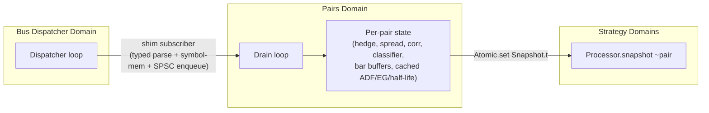
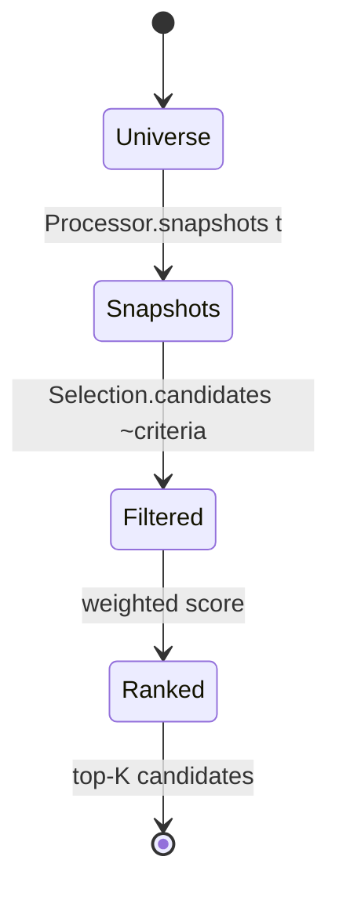

# Pairs Trading Framework Guide

`lib/pairs` is the layer that takes tick streams + closed bars from upstream layers (event bus +
`lib/time_series`) and produces, for each tracked pair of symbols, an immutable `Snapshot.t`
carrying β, spread, z-score, rolling correlation, ADF p-value, half-life, cointegration verdict,
and a mean-reversion signal. Downstream strategy code reads these snapshots via `Atomic.get` —
same publication contract as `lib/analytics`.

This sits between market-data processing (ingestion, statistics, time series, normalization) and
execution (signal generation, position sizing, order routing).

## Concurrency model



- **Single Pairs Domain** owns every `Per_pair.t` and is the sole writer.
- The bus shim subscriber is O(1): typed parse via `Tick_event.of_event_payload`, hashtable
  membership against the symbols-of-interest set, then `SPSCQueue.enqueue`. Drops on full queue
  with a counter.
- Cross-Domain reads from strategies use `Processor.snapshot ~pair`, which `Atomic.get`s a fresh
  immutable `Snapshot.t`. No torn reads — `Snapshot.t` is allocated fresh on every publish.
- Bars are admin-fed via `Processor.feed_bar : t → Bar.t → unit`. Bars are not yet on the event
  bus; a follow-up PR will add a bar-publisher bridge. The Domain caches the most recent bar per
  symbol and only fires `Per_pair.on_bar` when both legs report a bar with the same `open_ts`.

## What the layer produces

For every active pair, the layer maintains:

| Snapshot field                                      | Source                                                | Notes                                                                                               |
| --------------------------------------------------- | ----------------------------------------------------- | --------------------------------------------------------------------------------------------------- |
| `beta` / `intercept`                                | `Hedge_ratio`                                         | rolling-OLS `cov(x,y)/var(x)` by default; Static and Kalman-smoothed modes via `Config.beta_mode`   |
| `beta_stdev`                                        | `Rolling_var` over β history                          | stability metric used by `Selection`                                                                |
| `spread` / `spread_mean` / `spread_std` / `z_score` | `Spread`                                              | `s = y − β·x − α`; rolling mean/var with periodic recompute                                         |
| `corr`                                              | `Correlation` (over `Rolling_corr`)                   | rolling Pearson on price levels                                                                     |
| `adf_t_stat` / `adf_p_value` / `cointegrated`       | `Cointegration.Engle_granger`                         | bar-cadence retest every `coint_retest_bars` closed bars once `coint_min_bars` samples are buffered |
| `half_life_bars`                                    | `Mean_reversion.half_life`                            | AR(1) fit on the EG residuals; NaN if non-reverting                                                 |
| `signal`                                            | `Mean_reversion` classifier                           | `Long_spread \| Short_spread \| Exit \| Hold` over the z-score with entry / exit / stop-out bands   |
| `avg_volume`                                        | `Rolling_mean` over `min(y_bar.volume, x_bar.volume)` | liquidity proxy for `Selection`                                                                     |
| `ready`                                             | composite                                             | β estimator ready AND spread has ≥ 4 samples                                                        |

Strategies poll on tick:

```ocaml
let snap = Algostream_pairs.Processor.snapshot proc ~pair:pid in
if snap.ready && snap.cointegrated then
  match snap.signal with
  | Long_spread  -> (* … buy y, sell β·x … *)
  | Short_spread -> (* … sell y, buy β·x … *)
  | Exit         -> (* … flatten … *)
  | Hold         -> ()
```

## Numerical correctness

Three load-bearing decisions:

1. **No new opam dependencies.** ADF needs a small OLS solver, so `lib/pairs/ols.ml` rolls one
   by hand: build the `p × p` Gram matrix `G = AᵀA` in a single pass, Cholesky factor `G = L Lᵀ`
   with a Tikhonov ridge of `1e-12·I` added to the diagonal (so a singular Gram becomes a clean
   ``Error `Singular`` rather than NaN-producing), forward + back-substitute for `β`, then
   per-column back-substitution to recover the diagonal of `G⁻¹` for standard errors. Designed
   for `p ≤ 5` (the ADF and AR(1) half-life fits), where a hand-rolled solver is cheap — a
   single ADF on 256 bars at `lag = 1` is ~6 k flops — and avoids a lacaml or owl dependency.

2. **Engle-Granger residual ADF uses cointegration critical values, not unit-root values.**
   `lib/pairs/mackinnon_cv.ml` embeds two MacKinnon (1996) tables: Table 1 (unit-root, three
   variants) and Table 2 (cointegration, k=2). The Engle-Granger code computes the residual
   t-stat against Table 2 — using Table 1 here would underestimate p-values and report
   cointegration where none exists. p-values are coarse piecewise-linear interpolations between
   the 1%/5%/10% anchors, clamped to `[0.001, 0.20]`. The `.mli` is explicit: no claim of >2
   significant figures.

3. **Johansen is an honest stub.** `Cointegration.Johansen.test` returns
   ``Error `Not_supported_in_v1``. Implementing it properly requires an N×N generalized
   eigenvalue decomposition, which is not worth hand-rolling. The public signature is wired
   so a linear-algebra dependency can fill it in without churning callers. An explicit error
   beats a silently-partial implementation that strategies might trust.

## Bar boundary + cross-leg alignment

Cointegration tests run on bar closes, not ticks — bars give a clean event-time grid and
reduce ADF noise. `Per_pair.on_bar` requires both legs to carry the same `open_ts`; the
processor is responsible for matching arriving bars by `open_ts` before calling `on_bar`.
Misaligned or out-of-order bars are silently ignored. A `last_bar_close_ts` dedupe stops the
same `(open_ts)` from triggering two retests if the second bar arrives twice (e.g., from a
restart).

Once both legs are aligned, the bar closes go into per-leg circular buffers (cap =
`max 64 (coint_min_bars * 4)`); when `bars_since_retest` crosses `coint_retest_bars` AND both
buffers hold ≥ `coint_min_bars` samples, the retest fires:

1. Snapshot both buffers (cheap — `Array.blit` from circular into linear).
2. `Cointegration.Engle_granger.test` → returns `{beta; intercept; residuals; residual_adf;
cointegrated}`.
3. `Mean_reversion.half_life` on the residuals.
4. Cache `last_adf` / `last_eg` / `last_half_life` for the next tick to publish.

The cointegration result surfaces on the next tick's snapshot, not on a dedicated publication
path — this keeps the publication contract single-writer-single-channel.

## Event-time determinism

All time arithmetic in `lib/pairs` reads from `tick.timestamp_ns` / `bar.close_ts`. CI grep
(`.github/workflows/ci.yml`) bans `Clock.now_*` and `Unix.gettimeofday` under `lib/pairs/`,
and `test/pairs/test_determinism.ml` runs a local in-tree scan + a property test that replays
the same stream twice and asserts byte-equal final Snapshot fields. Local `make
pairs-clock-lint` mirrors the CI check.

The `min_publish_interval_ns` throttle (default 1 ms event time) lives in `Per_pair.on_tick`:
a snapshot is published only when `ts_ns − last_publish_ts_ns ≥ min_publish_interval_ns`. With
1 ms event-time spacing this never throttles ticks that are < 1 ms apart but does prevent the
snapshot allocation rate from going wild when fixture data spans nanosecond-resolution
timestamps.

## Selection workflow



- `Selection.enumerate_pairs (All_pairs_of syms)` produces `N(N-1)/2` lex-ordered `Pair_id.t`s.
- `Selection.candidates snapshots criteria` filters on `min_n` (samples), `min_corr`,
  `max_adf_pvalue`, `min_half_life_bars` / `max_half_life_bars`, `max_beta_stdev`,
  `min_avg_volume`. Drops NaN half-lives.
- Default rank: `0.4·(1 − p_value) + 0.4·|corr| + 0.2/(1 + half_life)`. Sensible heuristic;
  strategies override by computing their own ranker.

## β estimator choices

`Config.beta_mode`:

- **`Static of float`** — fixed β. Best when you have a strong prior (e.g., delta-1 hedge on
  ETF vs. underlying basket).
- **`Rolling_ols`** _(default)_ — `cov(x, y) / var(x)` over `Config.beta_window`, periodic
  full recompute every `recompute_every` ticks. Same `Rolling_var` recompute trick that
  `lib/analytics` uses to bound long-running float drift. When `Rolling_var(x) < 1e-12` (flat
  regressor — calm regime), β holds at its previous value and `beta_frozen_ticks` increments;
  surface this counter when regime transitions matter.
- **`Kalman_smoothed`** — passes the rolling-OLS β through `Filters.Kalman1d`, treating
  rolling β as a noisy measurement of true β. Use when rolling β is too jumpy at your window.

## Tests + benchmarks

```bash
# All 40 tests in 12 suites
dune runtest test/pairs

# Lint
make pairs-clock-lint

# Bench (Apple Silicon: ~800k ev/s direct, ~700k ev/s through bus on single pair)
make pairs-bench
```

The bench (`test/performance/pairs_throughput.exe`) is registered in `.github/workflows/
benchmark.yml` and posts to the gh-pages dashboard. Regression floor: 20 000 ev/s direct.

