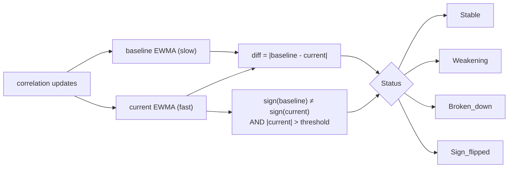

# Risk Management Engine Guide

`lib/risk_management` is the portfolio-level risk layer that consumes Portfolio state +
recent returns + (optionally) Pairs correlations + a fitted GARCH model and produces a
single `Risk_snapshot.t` per update — VaR, Expected Shortfall, drawdown metrics, exposures,
correlation breakdown status, circuit breaker state, and a list of any limit breaches.

Nine modules, four layers:

| Layer            | Modules                                                |
| ---------------- | ------------------------------------------------------ |
| Math / detectors | `Var`, `Drawdown`, `Correlation_breakdown`, `Exposure` |
| State machines   | `Circuit_breaker`, `Monitor`                           |
| Schema           | `Risk_limits`, `Risk_snapshot`                         |
| Composite        | `Proprietary_models`                                   |

Pure-math + lightweight stateful objects — no Domain ownership. Strategies own the
`Monitor.t` and `Portfolio.t`. Same architectural shape as `lib/advanced_models/` and
`lib/order_management/`.

## Reuse stance

The existing `lib/domain/portfolio/portfolio.ml`'s `Risk_metrics` module already had
historical-sim VaR + ES + max DD — used in backtests and untouched by this PR. The new
`Var.Historical` wraps those functions inside a uniform `result` record. The other three
methods (`Parametric_normal`, `Cornish_fisher`, `Garch_forecast`) are new.

The portfolio `Circuit_breaker` mirrors the proven state machine shape from
`lib/data_ingestion/connection_supervisor.ml` (which guards network connections):
`Active → Tripped → Recovering`. Different trigger kinds, same control flow.

## Four VaR methods

```ocaml
type method_ =
  | Historical
  | Parametric_normal
  | Cornish_fisher
  | Garch_forecast of Algostream_advanced_models.Garch11.t
```

| Method              | When to use                                    | Notes                                                                                                                                  |
| ------------------- | ---------------------------------------------- | -------------------------------------------------------------------------------------------------------------------------------------- |
| `Historical`        | Default for backtests; robust to non-normality | Empirical quantile + tail mean. Slow to react to regime changes (equal-weight history). Wraps existing `Portfolio.Risk_metrics`.       |
| `Parametric_normal` | Returns approximately normal; need fast        | `VaR = -(mu + sigma * Phi^{-1}(1-alpha))`. O(n) for sample stats.                                                                      |
| `Cornish_fisher`    | Returns have known skew / fat tails (n ≥ 100)  | Adjusts the normal quantile via Cornish-Fisher expansion in skew & kurtosis. Falls back to `Parametric_normal` for degenerate samples. |
| `Garch_forecast g`  | Forward-looking, regime-aware                  | Replaces sample sigma with `Garch11.current_variance g`. Captures volatility clustering.                                               |

All four return the same `result` record so callers can switch methods without changing
call-site shape. `method_used : string` records which path actually ran for audit logging.
Coarse-precision caveat carries over from `Advanced_models.Special`.

### Worked example

```ocaml
open Algostream_risk_management

(* Historical: backtest-style *)
let h = Var.compute ~method_:Var.Historical ~returns ~portfolio_value:100_000.0
          ~confidence:0.95 ~horizon_days:1

(* Parametric for fast path *)
let p = Var.compute ~method_:Var.Parametric_normal ~returns ~portfolio_value:100_000.0
          ~confidence:0.95 ~horizon_days:1

(* GARCH-forecast for forward-looking risk *)
match Algostream_advanced_models.Garch11.fit ~returns () with
| Ok fit_res ->
  let garch = Algostream_advanced_models.Garch11.of_fit fit_res
                ~last_return:returns.(Array.length returns - 1)
                ~last_variance:fit_res.long_run_variance in
  let g = Var.compute ~method_:(Var.Garch_forecast garch) ~returns
            ~portfolio_value:100_000.0 ~confidence:0.95 ~horizon_days:1
| Error _ -> ...
```

## Drawdown tracker

`Drawdown.Tracker.t` is the streaming online complement to
`Portfolio.Risk_metrics.calculate_maximum_drawdown` (which computes max DD offline).
Maintains running peak, current DD, max DD, and time-under-water in nanoseconds.

```ocaml
let t = Drawdown.Tracker.create ~initial_equity:100_000.0 () in
Drawdown.Tracker.update t ~equity:110_000.0 ~ts_ns:1_000_000L;
Drawdown.Tracker.update t ~equity:95_000.0  ~ts_ns:2_000_000L;
(* current_drawdown t = (110_000 - 95_000) / 110_000 ≈ 0.136 *)
(* time_under_water_ns t = 1_000_000L (ns since equity dropped below peak) *)
```

Out-of-order `ts_ns` updates are silently ignored — no rewinding the peak.

## Correlation breakdown detector



Two EWMAs over the correlation feed. Default `baseline_period = 60`, `current_period = 10`,
`breakdown_threshold = 0.3`. Status ladder:

- `Stable` — diff < threshold/2
- `Weakening` — threshold/2 ≤ diff < threshold
- `Broken_down` — diff ≥ threshold
- `Sign_flipped` — overrides others when baseline & current have opposite signs AND
  |current| > threshold

Built on `Algostream_analytics.Filters.Ewma`.

## Circuit breaker

State machine mirroring `lib/data_ingestion/connection_supervisor.ml`:

```
Active ─trigger→ Tripped ─cooldown_ns elapsed→ Recovering ─reset→ Active
```

Triggers checked in order on each `evaluate` (first hit wins):

1. `Drawdown_breach` — current drawdown > `max_drawdown`
2. `Daily_loss_breach` — negated daily PnL > `max_daily_loss`
3. `Leverage_breach` — leverage > `max_leverage`
4. `Vol_spike` — realized_vol / baseline_vol > `vol_spike_ratio`
5. `Manual` — via `trip_manual ~reason ~ts_ns`

`is_tripped` returns true in both `Tripped` and `Recovering` states — callers must
explicitly `reset` to return to `Active` (or wait + reset for safer recovery).

Cooldown is in **event time** (deterministic under replay). Production wall-clock-driven
recovery is a strategy-side concern.

## Risk limits & pre-trade checks

```ocaml
type t = {
  max_drawdown : float;                    (* gate + Monitor *)
  max_daily_loss : float;                  (* gate + Monitor *)
  max_leverage : float;
  max_var_pct : float;                     (* Monitor only *)
  max_position_concentration : float;
  max_gross_exposure : float;              (* gate only *)
  correlation_breakdown_threshold : float; (* Correlation_breakdown.Detector *)
}

val default : t

val pre_trade_check
  : t -> portfolio:Portfolio.portfolio
  -> proposed_order:Order.order -> ?proposed_price:float
  -> ?current_drawdown:float -> ?daily_pnl_pct:float -> unit
  -> breach list
```

Returns an empty list when within limits. When `~proposed_price` is supplied, it simulates the
order's effect on per-symbol concentration and gross exposure and reports breaches the trade
_would_ create.

### Path-dependent limits

Drawdown and daily loss cannot be computed from a portfolio snapshot — both need history the
snapshot does not carry. Rather than give this module state, the gate takes them as scalars and the
caller owns the tracking. `Drawdown.Tracker` already does exactly that, and both call sites hold
one: `Backtest.Engine` and `Runtime.Instance`. The comparisons match `Monitor.update`, so the
pre-trade gate and the monitoring snapshot cannot disagree about whether a limit is breached.

Omitting the two arguments defaults them to `0.0`, which **disables** those checks rather than
tripping them — every caller that has not been updated keeps its previous behaviour.

> **This was broken until recently, and it is worth knowing why the fix matters.** `pre_trade_check`
> saw only a snapshot, so it could emit `Leverage`, `Gross_exposure` and `Position_concentration`
> and nothing else. `Monitor` constructed the drawdown, daily-loss and VaR breaches — but `Monitor`
> is wired into neither the backtest engine nor any strategy. The net effect was that
> `max_drawdown` was read by nothing on the trading path: setting it changed no behaviour, and a
> backtest comparing "risk limits on" against "risk limits off" would have reported a difference of
> exactly zero. `test/backtest/test_engine.ml` now runs one scenario at two ceilings and asserts the
> tighter one rejects, which is what makes the limit's effect attributable.

Three fields were removed rather than left as advertisements for control that did not exist:
`max_asset_class_concentration` and its `Asset_class_concentration` breach had no producer anywhere,
and `vol_spike_ratio` duplicated `Circuit_breaker.config`'s field of the same name, which is the one
actually read. `correlation_breakdown_threshold` was in the same state — `Monitor` built its
detectors with library defaults and silently discarded the configured value — and is now passed
through, so tuning it does something.

`max_var_pct` stays `Monitor`-only: a VaR gate needs a return distribution that the pre-trade path
does not have.

### Risk-reducing orders are never blocked

The gate runs on every submit, including the order that closes a position. An earlier version
blocked those too, which made the drawdown limit **actively harmful**: once equity breached the
ceiling the strategy could not exit the position that caused the breach, so the loss the limit
existed to cap ran on unbounded.

Measured on an hour of real Coinbase BTC/ETH ticks, with a ceiling set low enough to bind:

| | limits off | limits on, exits blocked | limits on, exits exempt |
|---|---|---|---|
| max drawdown | baseline | **+1713%** | **−36.6%** |
| total return | baseline | **−2278%** | **+2.9%** |
| orders rejected | — | 10 of 12 | 4 of 12 |

(The −36.6% is at one particular equity-sampling interval; see the caveat below before quoting it.)

`pre_trade_check` therefore returns `[]` immediately for an order that moves the position towards
flat. "Towards flat" is deliberately strict — opposite in sign to the holding and no larger than it.
An order that crosses through flat and opens the other side is an entry wearing a reduction's
clothes and is gated normally, or a strategy could take unlimited new risk by routing it through a
reversal.

> **What this does not show.** Those percentages are ratios of very small numbers: the absolute
> drawdown on that capture is under 0.01% of NAV over 12 fills, and the ceiling had to be set far
> below any realistic value to bind at all. The direction is right and the mechanism is verified;
> the 30% drawdown-improvement target still needs a horizon over which the strategy takes real
> drawdown.

### Drawdown tracking is decoupled from equity sampling

The running peak is fed on **every event**, not from the equity-sampling callback.
`equity_sample_interval_ns` (and `nav_sample_interval_ns` on the live side) bounds how much equity
history is *stored*; it must not decide how accurately risk is measured.

When the two shared one call, a coarse interval left the peak stale, the gate saw a smaller
drawdown than had occurred, and it admitted orders it should have refused — a logging setting
silently changing trading decisions. The same capture at the same ceiling rejected 4 orders at a
10 s interval and 2 at 60 s. It is now 4 at every interval from 1 s to 60 s, and
`test/backtest/test_engine.ml` pins that with a scenario where NAV rises between two coarse samples
before falling.

The *reported* reduction still varies with the interval — 1.6% at 1 s to 80.3% at 60 s — because
`Metrics.of_nav` can only measure the drawdown present in the sampled curve. That is inherent to
sampled measurement rather than a defect, and it is the main reason no single percentage from this
dataset is worth quoting.

## Monitor — putting it together

```ocaml
let m = Monitor.create
          ~limits:Risk_limits.default
          ~circuit_config:{
            max_drawdown = 0.20; max_daily_loss = 0.05;
            max_leverage = 3.0; vol_spike_ratio = 5.0;
            cooldown_ns = 10_000_000_000L;  (* 10s event time *)
          }
          ~initial_equity:100_000.0
          ()

(* Each tick / bar, strategy calls: *)
let snap = Monitor.update m
             ~portfolio
             ~returns
             ~correlation_updates:[ ("BTC", "ETH", current_pair_corr) ]
             ~garch:fitted_garch_or_omit
             ~ts_ns:current_event_ts
             ()

(* Cross-Domain readers do: *)
let snap = Atomic.get (Monitor.snapshot_atomic m)

(* Gate the strategy on snap.circuit_breaker_state / snap.breaches *)
if Circuit_breaker.is_tripped (
  match snap.circuit_breaker_state with
  | Active -> false | _ -> true |> ignore;
  Monitor.circuit_breaker_state m
)
then halt_new_orders ()
```

`update` re-runs all the math and publishes a fresh `Risk_snapshot.t` via `Atomic.set` in
one call. Strategy and risk-display Domains read via `Atomic.get` on `snapshot_atomic` —
race-free, no torn reads.

## Event-time invariant

CI `for dir in …` clock-lint loop covers `lib/risk_management` (`make risk-clock-lint`
locally). All time inputs are explicit `int64` ns parameters — no `Clock.now_*`, no
`Unix.gettimeofday`. The portfolio circuit breaker's cooldown is in event time so replay
is deterministic; strategies that want wall-clock recovery (e.g., "auto-reset after 10
real seconds") schedule that externally.

## Composite risk score (Proprietary_models)

The per-dimension signals are useful on their own, but strategies usually want a single
number to drive graduated risk responses. `Proprietary_models` bundles them.

```ocaml
let snap = Monitor.update m ~portfolio ~returns ~ts_ns () in
let score = Proprietary_models.from_snapshot
              ~snapshot:snap
              ~limits:Risk_limits.default
              ~realized_vol:(Monitor.realized_vol m)
              ~baseline_vol:(Monitor.baseline_vol m)
              ()

(* Graduated response *)
match score.level with
| Critical -> halt_strategy ()
| High     -> reduce_position_size_by 0.5
| Moderate -> tighten_stops_by 0.3
| Low      -> proceed_normally ()
```

Each of the five components — `var_component`, `drawdown_component`, `leverage_component`,
`correlation_component`, `circuit_component` — is normalized to `[0, 1]` (0 = well within
limit, 1 = at or beyond limit). The `composite` is the weighted average (default weights
bias toward forward-looking signals: VaR 0.30 + drawdown 0.25 + leverage / correlation /
circuit 0.15 each). Strategies override `~weights` when they have a different risk philosophy.

The independent `vol_regime` classification:

| Regime     | realized / baseline ratio |
| ---------- | ------------------------- |
| `Calm`     | < 0.5                     |
| `Normal`   | 0.5 ≤ ratio < 1.5         |
| `Elevated` | 1.5 ≤ ratio < 3.0         |
| `Stressed` | ≥ 3.0                     |

This is independent of the `composite` so a strategy can reduce size when vol gets
`Elevated` even before the limits are formally breached.

## Tests + benchmarks

```bash
dune runtest test/risk_management        # 40 tests across 9 suites
make risk-clock-lint
make risk-bench                          # Apple Silicon: parametric ~158k ev/s,
                                         # historical ~41k ev/s, drawdown ~60M ev/s,
                                         # monitor ~76k ev/s
```

The bench is registered in `.github/workflows/benchmark.yml` and posts to gh-pages.

