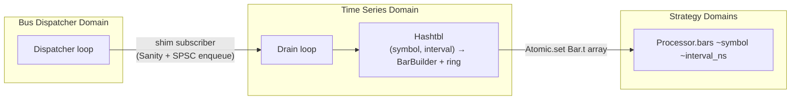

# Time Series Management Guide

`lib/time_series` builds OHLCV bars from the live event stream, aligns multi-symbol series onto
a common time grid, fills gaps, and compresses columns for transport. Sits between
[Statistical Data Processing](analytics.md) and the strategy layer.

## What it produces

For every active `(symbol, interval)` pair the layer maintains a rolling array of recent
[`Bar.t`](../../lib/time_series/bar.mli):

```ocaml
type t = {
  symbol : string;
  open_ts : int64;     (* event-time, half-open [open_ts, close_ts) *)
  close_ts : int64;
  open_ : float;
  high : float;
  low : float;
  close : float;
  volume : float;
  n_ticks : int;
  partial : bool;      (* true only for bars emitted by BarBuilder.flush at replay end *)
}
```

Strategies query the most recent N bars race-free:

```ocaml
let proc = Algostream_time_series.Processor.start ~bus
             ~intervals_ns:[ 1_000_000_000L; 60_000_000_000L ] () in
match Processor.bars proc ~symbol:"BTCUSDT" ~interval_ns:60_000_000_000L with
| Some bars -> Array.iter (fun b -> Printf.printf "%s\n" (Bar.to_csv_row b)) bars
| None -> ()
```

## Concurrency model



- Bus shim is O(1) — Sanity check + SPSC enqueue.
- A dedicated Time Series Domain drains the SPSC and updates per-`(symbol, interval)`
  `Bar_builder.t` instances.
- Each `(symbol, interval)` pair has its own `Bar.t array Atomic.t`. On every bar close the
  writer publishes a *fresh* (immutable) array; readers `Atomic.get` and see either the previous
  or the new whole array — never a torn read.
- LRU cap defaults to 256 active pairs; the oldest is evicted on overflow.

## Bar boundary

Half-open intervals: `[bar_open_ts, bar_open_ts + interval_ns)`.

- `bar_open_ts = floor(tick.timestamp_ns / interval_ns) * interval_ns`
- A tick whose `ts == close_ts` belongs to the **next** bar.
- A tick whose `ts < current_bar.open_ts` (out-of-order, late) is **dropped + counted**. Closed
  bars are never rewritten.
- `BarBuilder.flush` returns the partial open bar (with `partial = true`) for replay-end use;
  real-time bar streams never invoke flush.

## Alignment

`lib/time_series/align.ml` snaps multiple `Series.t` onto a common timestamp grid.

| Pad policy | Meaning |
|---|---|
| `Pad_nan` | fill missing rows with `Float.nan`; validity column tracks holes |
| `Drop` | skip rows where any column is missing |
| `Skip_until_all_present` | output starts at the first grid point where every series has data |

| Gap fill | Meaning |
|---|---|
| `Forward_fill` | use last-known value |
| `Linear` | linearly interpolate between surrounding valid rows |
| `Leave_nan` | honest holes; downstream sees NaN |

**Interpolation across feed-down gaps is forbidden.** A series outage is detected via
`Feed_health.gap_at` (the hookpoint for gap reporting) and the alignment routine writes 0 to the validity
column for any row inside that window — interpolating across an outage fabricates ticks that
never existed.

## Compression

`lib/time_series/compress.ml` implements **Gorilla XOR-delta-of-bits** for floats and **delta +
zigzag varint** for monotonic int64 timestamps. Both round-trip exactly:

- Floats: `Int64.bits_of_float` → XOR with previous → varint over significant-bytes block.
  Round-trips NaN, ±Inf, ±0, denormals, signed values without modification — encoder never
  interprets the value as a number.
- Timestamps: `delta = ts[i] - ts[i-1]` → zigzag → varint. Monotonic, sub-millisecond gaps
  compress to ~1-2 bytes per value.

Reference numbers (Apple Silicon, release):

- Bar builder: **~42M tick/s** direct, 23 ns/tick.
- Float compression: ~1.1 bytes/value on a random walk (high-entropy XOR), much better on
  real markets where prices repeat.
- Int64 timestamps: **~3.8 bytes/value** (compression ratio 0.47).

## Determinism

Every time arithmetic in `lib/time_series` reads from `tick.timestamp_ns` — never wall-clock.
Enforced by `make ts-clock-lint` and a CI step. `algostream-bars` replayed twice over the same
event log produces identical CSV output (used in CI as the determinism check).

## CLI

```bash
# Replay a captured event_log into 1-minute bars and print CSV
make bars LOG=/tmp/ingest.log INTERVAL=1m SYMBOL=BTCUSDT
# Or directly:
dune exec bin/bars.exe -- --log /tmp/ingest.log --interval 1m --symbol BTCUSDT
```

Output:

```
symbol,open_ts,close_ts,open,high,low,close,volume,n_ticks,partial
BTCUSDT,1700000000000000000,1700000060000000000,50001.5,50012.0,49998.2,50007.3,12.7,143,false
...
```

## Source map

| Module | Path |
|---|---|
| Top-level facade | `lib/time_series/processor.{ml,mli}` |
| Streaming bar emitter | `lib/time_series/bar_builder.{ml,mli}` |
| Bar record | `lib/time_series/bar.{ml,mli}` |
| Columnar buffers | `lib/time_series/column.{ml,mli}` |
| Multi-column timestamped series | `lib/time_series/series.{ml,mli}` |
| Multi-symbol alignment | `lib/time_series/align.{ml,mli}` |
| Gap interpolation | `lib/time_series/interpolate.{ml,mli}` |
| Lossless compression | `lib/time_series/compress.{ml,mli}` |
| CLI | `bin/bars.ml` |
| Tests | `test/time_series/` |
| Throughput bench | `test/performance/bar_builder_throughput.ml` |
| Compression round-trip bench | `test/performance/compress_roundtrip.ml` |
